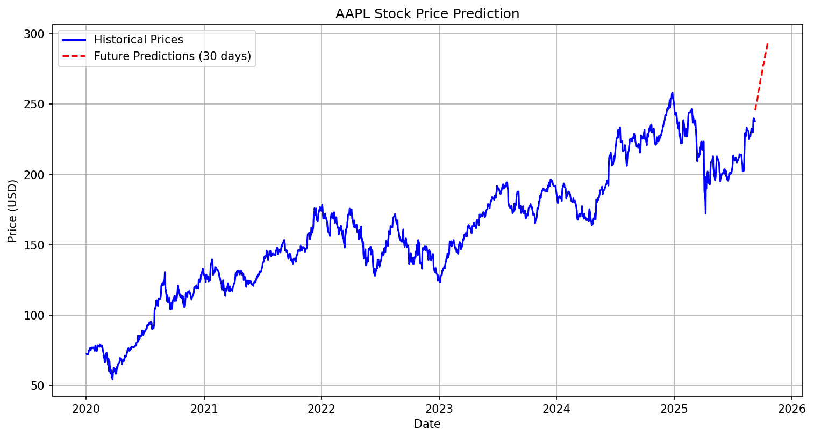

# 📈 Stock Price Prediction using LSTM (AAPL)

This project uses **LSTM neural networks** to predict Apple Inc. (AAPL) stock prices.  
It demonstrates time-series forecasting using deep learning.

---

## 🚀 Features

- Collects stock data using **yfinance**
- Scales and preprocesses data
- Builds an **LSTM model with Dropout layers**
- Predicts **next 30 days** of stock prices
- Visualizes actual vs predicted prices

---

## 📊 Example Plot

Here is a sample prediction result:



---

## ⚙️ Installation

Clone the repo and install dependencies:

```bash
git clone https://github.com/yourusername/stock-price-prediction.git
cd stock-price-prediction
pip install -r requirements.txt
```
